<p align="center">
  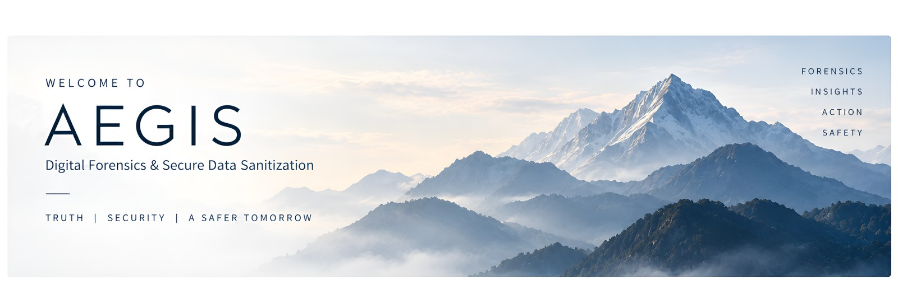
</p>

<h1 align="center">AEGIS</h1>

<p align="center">
  <strong>Digital forensics and secure data sanitization in one evidence-grade desktop workflow.</strong><br>
  Acquire &rarr; recover &rarr; analyse &rarr; sanitize &rarr; prove it, with every step hashed, ledgered and signed.
</p>

<p align="center">
  
  
  
  
  
  
  
</p>

<p align="center">
  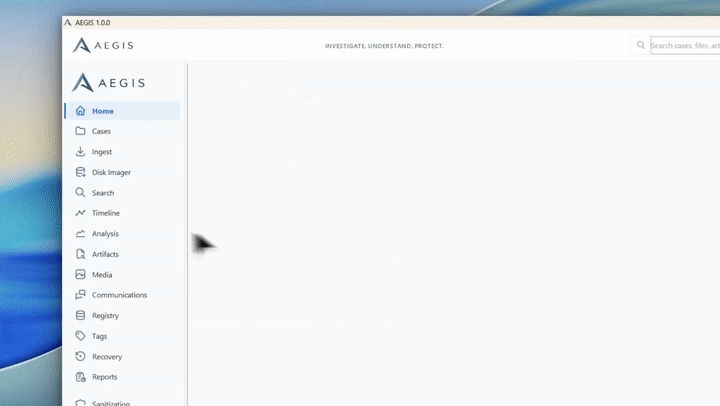
</p>

<p align="center">
  <a href="https://www.youtube.com/watch?v=hDIUGWyab3A"></a>
  <br>
  <sub>The GIF above is a short preview. The full walkthrough is on YouTube.</sub>
</p>

<p align="center">
  <a href="#solution-scope">Solution scope</a> &middot;
  <a href="#features">Features</a> &middot;
  <a href="#screenshots">Screenshots</a> &middot;
  <a href="#how-aegis-works">How it works</a> &middot;
  <a href="#safety-model">Safety model</a> &middot;
  <a href="#architecture">Architecture</a> &middot;
  <a href="#getting-started">Getting started</a> &middot;
  <a href="#documentation">Documentation</a>
</p>

---

## Solution scope

Organisations, government agencies and law-enforcement units need to do two opposite things to
storage: **destroy sensitive data beyond recovery** and **recover deleted data as evidence**. Today
these need separate tools, each with its own process and its own reports. AEGIS brings both into one
platform with three modules:

| Module | What it needs to do | How AEGIS delivers it |
|---|---|---|
| **1. Secure Drive Eraser** | Sanitize HDDs, SSDs, USB drives, memory cards and external storage, with verification, audit logging, tamper-resistant reporting and compliance with data-destruction standards. | Device sanitization of removable **USB drives, memory cards (SD/MMC) and USB-attached external disks**. Methods are offered from the device's *probed* capabilities (whole-drive overwrite, ATA / NVMe sanitize where the controller supports it). Every run has typed-serial authorization, identity re-binding before the first write, read-back verification and an Ed25519-signed report in **NIST SP 800-88 Rev. 2** terms (Clear / Purge). Internal system drives are refused by design. |
| **2. Secure File & Folder Eraser** | Selective deletion of files and folders, removal of associated metadata and residual traces, batch operations, verification of erasure and audit reporting across file systems. | Verified overwrite of files and whole folder trees by the native AEGIS sanitizer: slack-space overwrite, TRIM, flush, read-back check and metadata scrub. **Deep Forensic Purge** removes the traces Windows keeps of an erased file (Recent shortcuts, jump lists, Recycle Bin copies). Every operation lands in a hash-chained case ledger and a signed report. |
| **3. Advanced File Carving & Recovery** | Recover deleted files from formatted, damaged or corrupted media using signature-based, structure-based and intelligent carving, without file-system metadata and including fragmented files. | **Filesystem-aware undelete** (NTFS, FAT, exFAT, ext), **signature carving** (24 signatures) and **structure parsing** (16 formats) that work without file-system metadata, **bifragment reassembly** of split JPEG/PNG files, decoder validation and an explainable evidence score per object. Forensic **RAW / E01 acquisition** with SHA-256 and BLAKE3, and AI enhancement of recovered photos on labelled derivatives only. |

Across all three modules, AEGIS keeps everything inside one case. Evidence is only ever read, every
action goes into a tamper-evident ledger, and every result can be verified, either inside the app or
independently.

## Why AEGIS

Investigators usually stitch together one tool to image a drive, another to recover deleted files,
a third to wipe media, and a hand-written report at the end that nobody can later prove was not
edited. AEGIS does all of it in one application, under one case, with one audit trail:

- **Every byte of evidence is only read.** Images are opened read-only; recovery never writes to its
  source; AI enhancement works on derivatives, never on evidence.
- **Every operation is recorded** in a per-case, hash-chained ledger that detects any edit.
- **Every result is signed.** Acquisition, recovery and sanitization reports are Ed25519-signed and
  can be verified inside the app or independently.
- **Destructive actions are fail-closed.** Device sanitization is limited to removable USB/SD media,
  re-checks the device identity right before the first write, and refuses internal drives in the
  engine itself.

## Features

| | Module | What it does |
|---|---|---|
| 💽 | **Disk Imager** | 9-step guided acquisition of USB/SD devices or image files to **RAW** or **E01** (Expert Witness). One read pass computes **SHA-256 and BLAKE3**; unreadable sectors are retried, filled and recorded, never dropped. The image is then re-read and verified chunk by chunk, registered in the case and covered by a signed acquisition report. |
| 🧩 | **Advanced File Recovery** | Media map of the evidence, **filesystem-aware undelete** (NTFS, FAT, exFAT, ext), **signature and structure carving** (24 signatures, 16 format parsers), **bifragment reassembly** of split JPEG/PNG files, decoder validation and an explainable evidence score (HIGH / MEDIUM / LOW) for every object, with SHA-256 per recovered file. |
| ✨ | **AI Enhancement** | EDSR super-resolution (x2/x3/x4) for recovered photos, run on a **labelled derivative**. The original is re-hashed to prove it is unchanged and the model hash is ledgered. |
| 🧹 | **Data Sanitization** | **Files and folders**: verified overwrite by the native AEGIS sanitizer. **Devices (USB/SD only)**: methods offered from the device's *probed* capabilities, a typed-serial authorization, a backup gate, identity re-binding before the first write and read-back verification. Outcomes use NIST SP 800-88 Rev. 2 vocabulary (Clear / Purge). |
| 🧽 | **Deep Forensic Purge** | Removes the traces Windows keeps of an erased file (Recent shortcuts, jump lists, Recycle Bin copies) when they are tied to the erased path on evidence; the thumbnail cache is cleared only on request, through Restart Manager, without force-killing anything. |
| 📜 | **Report Viewer** | Signed JSON + PDF reports with **Verify Signature & Chain** and **Verify Audit Chain** built in. Tampering with a single byte turns a report to `FAILED_VERIFICATION`. |
| 🕸️ | **ORACLE** | A provenance-aware **knowledge graph** of the case: evidence, devices, recovered files, operations and reports, where every edge cites its source (ledger entry hash or Sleuth Kit object id). Timeline correlation, evidence paths and case insights, from recorded facts only. |
| 🔎 | **Analysis suite** | Full case analysis on the Sleuth Kit: file system views, keyword search, timeline, artifacts, media, communications, registry and tags. |

## Screenshots

<table>
  <tr>
    <td width="50%">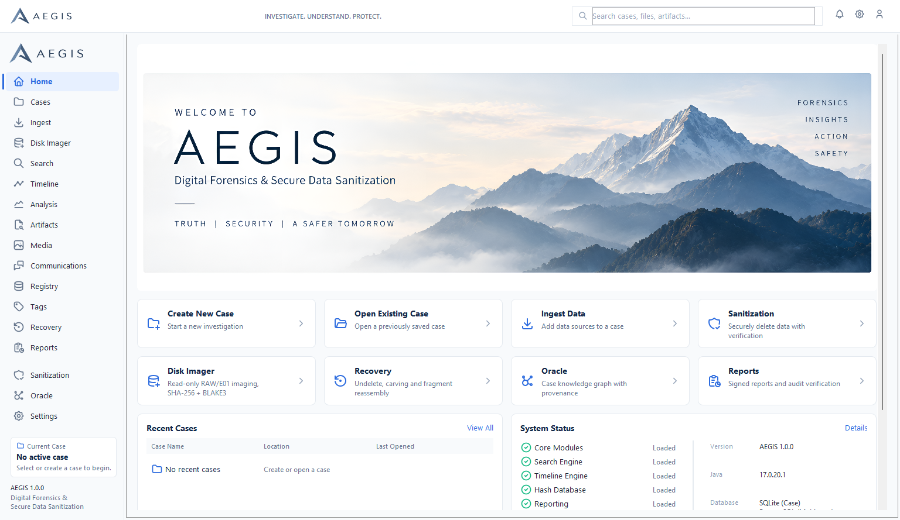<br><sub><b>Home</b> &mdash; live engine, E01 writer, privilege, ledger and signed-report status</sub></td>
    <td width="50%">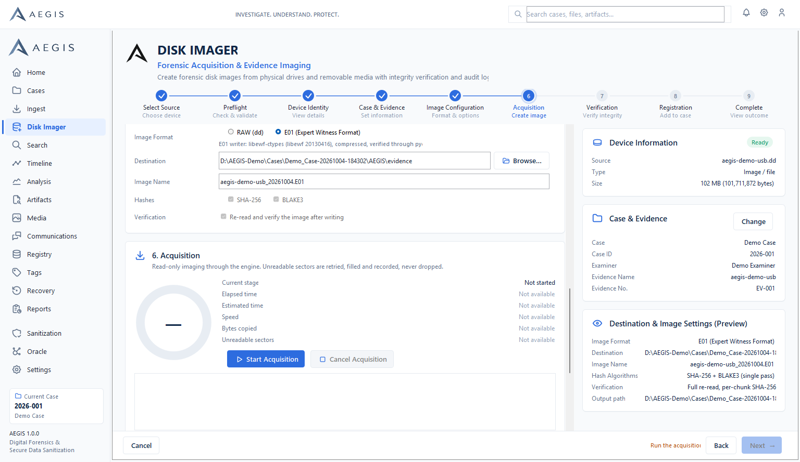<br><sub><b>Disk Imager</b> &mdash; 9-step acquisition with preflight and live destination preview</sub></td>
  </tr>
  <tr>
    <td>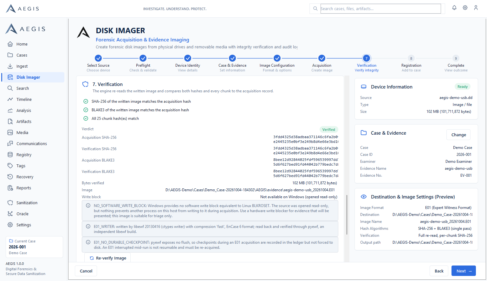<br><sub><b>Verified acquisition</b> &mdash; SHA-256 + BLAKE3 read-back, chunk comparison</sub></td>
    <td>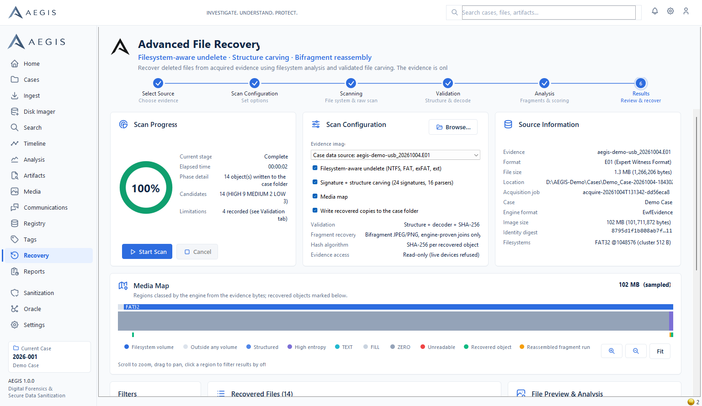<br><sub><b>Advanced File Recovery</b> &mdash; media map, undelete, carving, scored results</sub></td>
  </tr>
  <tr>
    <td>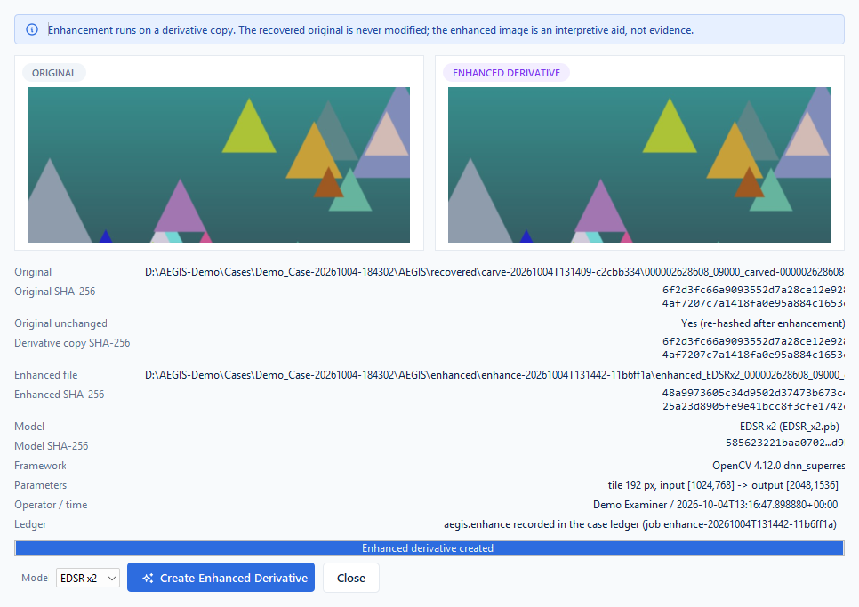<br><sub><b>AI Enhancement</b> &mdash; EDSR derivative beside the untouched original</sub></td>
    <td>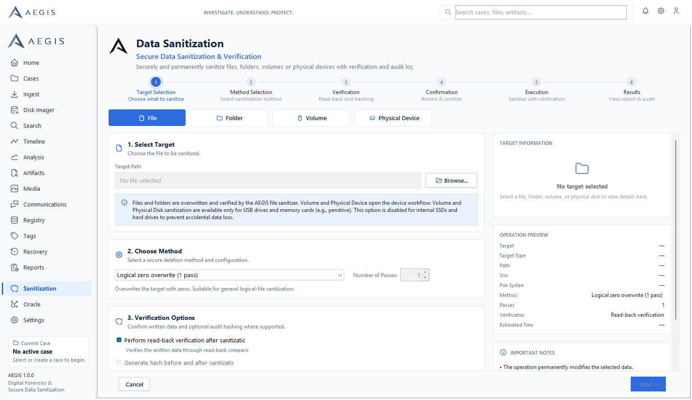<br><sub><b>Data Sanitization</b> &mdash; verified file / folder overwrite</sub></td>
  </tr>
  <tr>
    <td>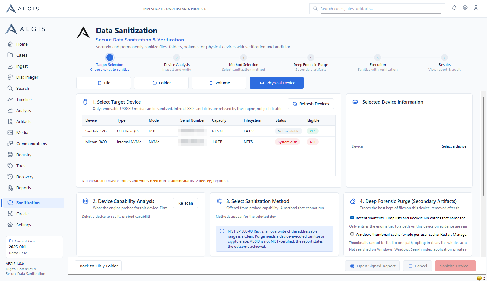<br><sub><b>Device Sanitization</b> &mdash; capability-driven methods; internal drives refused</sub></td>
    <td>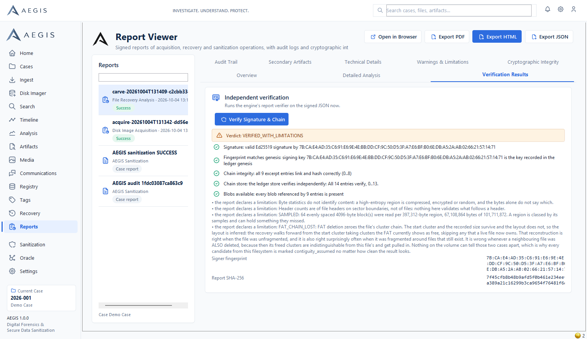<br><sub><b>Report Viewer</b> &mdash; Ed25519 signature and ledger chain verification</sub></td>
  </tr>
  <tr>
    <td>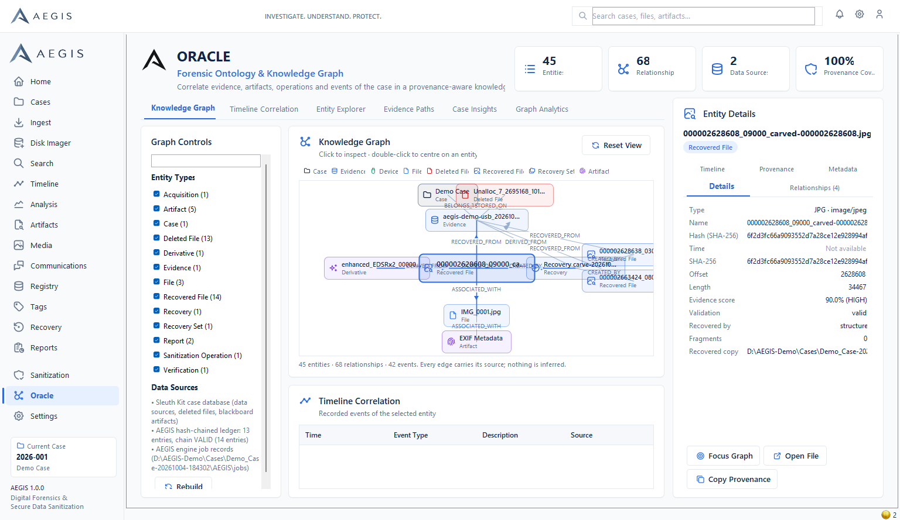<br><sub><b>ORACLE</b> &mdash; provenance knowledge graph of the case</sub></td>
    <td>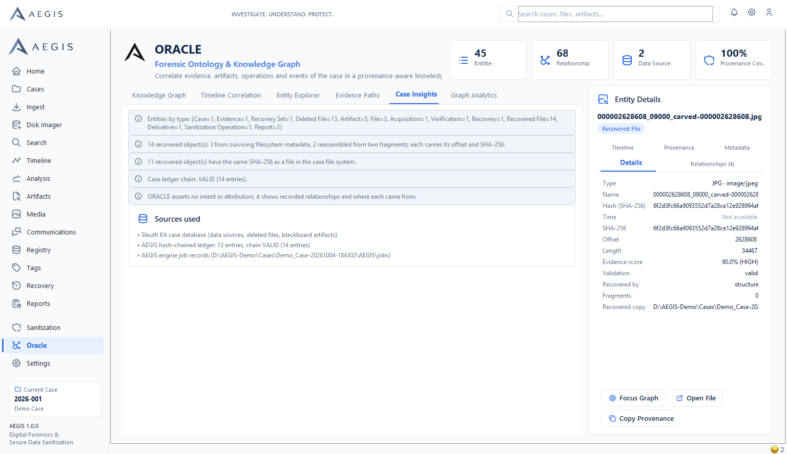<br><sub><b>ORACLE insights</b> &mdash; evidence paths and case insights from recorded facts</sub></td>
  </tr>
</table>

> Screenshots were captured from the packaged application running on a synthetic demo image
> (`tools/make-demo-evidence.py`); no real case data is shown.

## How AEGIS works

One case, one pipeline. Every arrow below is a recorded step: hashed, written to the case ledger and
covered by a signed report.

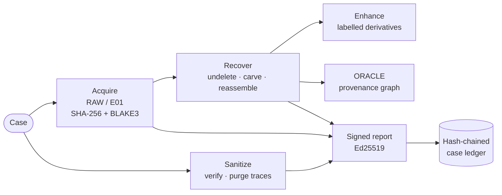

## At a glance

<table>
  <tr>
    <td align="center" width="33%"><h3>61.5 GB</h3><sub>USB stick acquired to E01 on real hardware<br>0 unreadable sectors, read-back verified</sub></td>
    <td align="center" width="33%"><h3>8,380</h3><sub>objects recovered and scored<br>from a real 8.6 GB pendrive image</sub></td>
    <td align="center" width="33%"><h3>24 + 16</h3><sub>carving signatures<br>+ structure parsers</sub></td>
  </tr>
  <tr>
    <td align="center"><h3>2 hashes, 1 pass</h3><sub>SHA-256 and BLAKE3<br>computed while the evidence is read</sub></td>
    <td align="center"><h3>Ed25519</h3><sub>signature on every acquisition,<br>recovery and sanitization report</sub></td>
    <td align="center"><h3>100% offline</h3><sub>no cloud, no telemetry;<br>evidence never leaves the workstation</sub></td>
  </tr>
</table>

## Built for

| | Who | What AEGIS gives them |
|---|---|---|
| 🛡️ | **Law enforcement and forensic labs** | Read-only acquisition, recovery of deleted evidence and reports that can be verified in court. |
| 🏢 | **Enterprises and government IT** | Verified sanitization of files, folders and removable media before reuse or disposal, with a signed certificate per job. |
| 🚨 | **Incident response teams** | One tool to image, recover, analyse and then securely clean up, all in a single audited case. |

## Safety model

AEGIS treats safety as an engine property, not a UI convention. The full model is in
[`docs/safety-model.md`](docs/safety-model.md); the essentials:

| Rule | Enforced by |
|---|---|
| Internal SSD / NVMe / SATA / SAS / RAID drives are **never** sanitized; only USB- or SD/MMC-attached media are eligible, and an unknown bus is refused | Engine bridge, the Windows device adapter, and the UI &mdash; three independent checks; a refusal is ledgered |
| The system / boot disk is never imaged live and never written | Engine (checked before privilege) |
| Device identity (disk number, serial, size) is re-resolved and bound to the write handle **immediately before the first write**; any change aborts | Engine |
| A destructive device operation needs a typed serial, an explicit acknowledgement, and either a verified AEGIS backup of the same serial or a ledgered `NO BACKUP` waiver | UI + engine |
| Evidence is opened read-only; recovery refuses live device paths; enhancement writes derivatives only | Engine |
| Explorer and other processes are never force-killed; Restart Manager asks them to close | Engine |
| Every action is appended to a hash-chained ledger; reports are Ed25519-signed with a DPAPI-protected key | Engine |

AEGIS is **not** NIST-certified. A single-pass overwrite is reported as a *Clear*; a *Purge* requires a
device-executed sanitize or crypto erase, and the report states the outcome actually achieved.

## Architecture

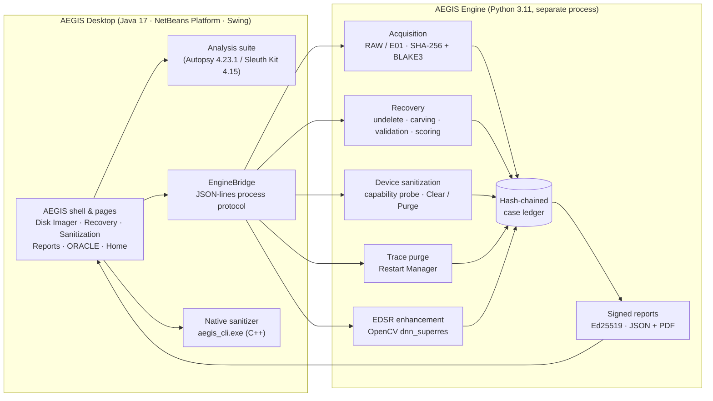

The desktop never links engine code: it starts the engine as a separate process and exchanges
`HELLO` / `PROGRESS` / `LOG` / `RESULT` JSON lines with it. Long work runs off the Swing event thread,
cancellation is a flag file, and the engine reports `CANCELLED` or `FAILED` &mdash; never a false success.
Details: [`docs/architecture.md`](docs/architecture.md).

### Per-case workspace

```
<case folder>\AEGIS\
  ledger\      hash-chained, content-addressed audit ledger
  jobs\        one record per operation (parameters, results, status)
  reports\     signed JSON + PDF reports
  evidence\    acquired images (RAW / E01 segments)
  recovered\   recovered files, named by original name or SHA-256
  enhanced\    AI-enhanced derivatives (never evidence)
  logs\        engine logs per operation
```

## Getting started

### Install

1. Download **`AEGIS-1.0.0-Setup.exe`** from [Releases](https://github.com/knightspan/Aegis/releases). The
   installer is distributed as a release asset rather than in git because it bundles the Java and Python
   runtimes (~2.6 GB installed).
2. Run it and choose *install for all users* (Program Files, needs administrator) or *only for me*.
3. Start **AEGIS** from the Start menu. Java 17 and the engine runtime are bundled; nothing else needs
   installing.
4. For physical USB/SD acquisition or device sanitization, use the **AEGIS (Administrator)** shortcut.

Uninstalling keeps your cases and `%APPDATA%\AEGIS` (profile and report-signing key).

| Requirement | |
|---|---|
| OS | Windows 10 or 11, 64-bit |
| Memory | 8 GB RAM minimum, 16 GB recommended |
| Disk | ~3 GB for AEGIS, plus space for images and recovered files |
| Privileges | Standard user; administrator only for raw device access |

### Source availability

The engine (Python) and the native file sanitizer (C++) are published in this repository. The
AEGIS desktop application source is proprietary and not published; use the installer from Releases.

## Repository layout

```
engine/               AEGIS engine (Python): acquisition, recovery, sanitization, ledger, reports
sanitizer/            native file/folder sanitizer (C++)
installer/            Inno Setup script and artwork for AEGIS-1.0.0-Setup.exe
tools/                test, demo and helper scripts
docs/                 documentation and screenshots
```

## Documentation

| Document | Contents |
|---|---|
| [User guide](docs/user-guide.md) | Every page and workflow, step by step |
| [Safety model](docs/safety-model.md) | What AEGIS will and will not do to a device, and where each rule is enforced |
| [Architecture](docs/architecture.md) | Components, process protocol, data flow, case workspace |
| [Engine reference](docs/engine-reference.md) | Engine commands, options and result fields |
| [Testing](docs/testing.md) | Test suites, how to run them, latest results |
| [Demo runbook](docs/demo-runbook.md) | A scripted walkthrough for live demonstrations |
| [Integration provenance](docs/integration-provenance.md) | Where each component comes from and what was changed |
| [Third-party notices](THIRD_PARTY_NOTICES.md) | Licences of the components AEGIS includes |

## Project status

AEGIS 1.0.0 is feature-complete for its demonstration scope. The full acquisition &rarr; recovery
&rarr; enhancement &rarr; sanitization &rarr; report &rarr; ORACLE flow passes an automated end-to-end
rehearsal inside the packaged application; a 61.5 GB USB stick was acquired to E01 and verified on
real hardware, and recovery was validated on a real 8.6 GB pendrive image (8,380 objects).

## License

Copyright &copy; 2026 knightspan. **All rights reserved.** AEGIS is proprietary software; see
[`LICENSE`](LICENSE). AEGIS is built on and distributed with third-party components, including
[Autopsy](https://www.autopsy.com/) and [The Sleuth Kit](https://www.sleuthkit.org/) (Apache-2.0 / CPL),
which remain under their own licences &mdash; see [`THIRD_PARTY_NOTICES.md`](THIRD_PARTY_NOTICES.md).
AEGIS is not affiliated with or endorsed by Basis Technology.
