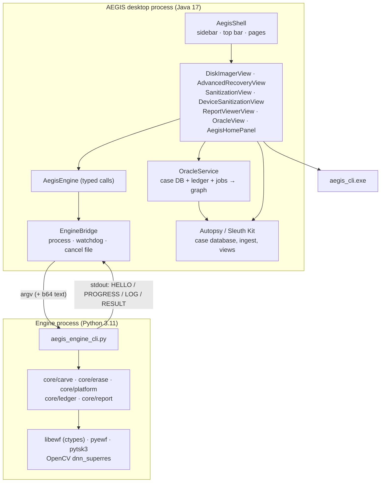
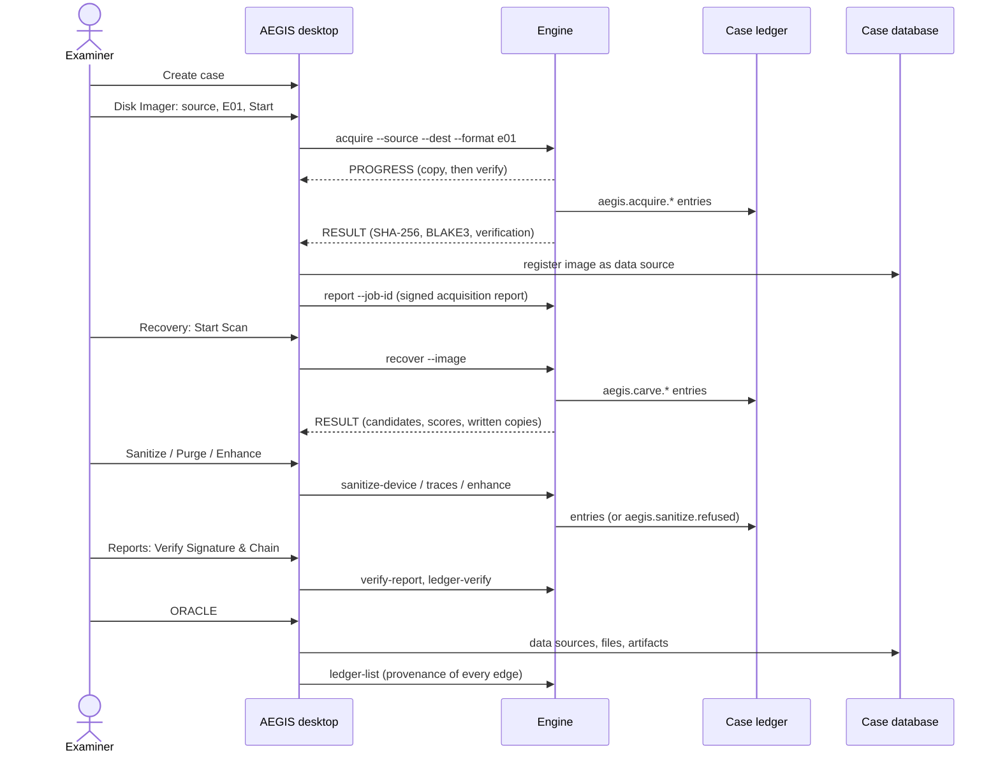
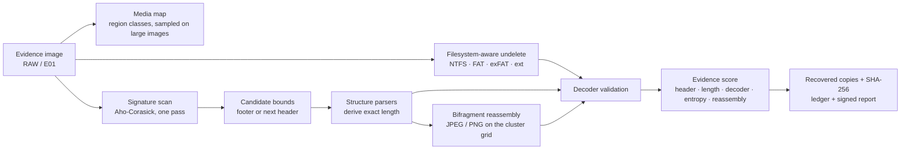

# AEGIS architecture

## Components

| Component | Technology | Location | Role |
|---|---|---|---|
| AEGIS desktop shell | Java 17, Swing, NetBeans Platform | `desktop/aegis-module` | Product UI: Home, Disk Imager, Recovery, Sanitization, Reports, ORACLE, sidebar, top bar, status |
| Analysis suite | Autopsy 4.23.1 + The Sleuth Kit 4.15.0 | upstream + `desktop/autopsy-overlay` | Cases, data sources, ingest, file views, search, timeline, artifacts |
| Engine bridge | Java (`EngineBridge`, `AegisEngine`) | `desktop/aegis-module/.../engine` | Starts the engine process, streams progress, cancellation, timeouts |
| AEGIS engine | Python 3.11 | `engine/` | Acquisition, recovery, device sanitization, trace purge, ledger, reports, enhancement |
| Native sanitizer | C++ (MinGW) | `sanitizer/` | File and folder overwrite with read-back verification |
| Launcher | C++ | `desktop/launcher` | `AEGIS.exe`: bundled Java runtime, AEGIS profile |



## The engine process protocol

The desktop never links engine code. For each operation `EngineBridge` starts
`runtime\python311\python.exe -X utf8 -u engine\aegis_engine_cli.py <command> <options>` and reads one
JSON object per line from its standard output:

| Event | Fields | Meaning |
|---|---|---|
| `HELLO` | `protocol`, `bridge_version`, `command`, `operation_id` | The process started and parsed its arguments |
| `PROGRESS` | `phase`, `pct`, `bytes_done`, `bytes_total`, `throughput`, `eta`, `message` | Real progress from the operation; never simulated |
| `LOG` | `level`, `message` | Operator-facing log lines |
| `RESULT` | `status`, `command`, `operation_id`, `result` (with `job_id`), `warnings`, `error` | Final outcome; `status` is `SUCCESS`, `SUCCESS_WITH_WARNINGS`, `FAILED`, `BLOCKED` (a safety gate refused), `UNSUPPORTED`, `UNAVAILABLE` or `CANCELLED`. A result too large for one line is written to a file named in `result.result_file`. |

Design decisions, each made after a real failure:

- **Standard input is never read.** On Windows, a thread blocked reading the stdin pipe deadlocked the
  loading of DLLs that query standard handles (NumPy, OpenCV). The desktop redirects stdin from `NUL`;
  cancellation is a **flag file** passed as `--cancel-file`, checked by the engine between units of work.
- **Free text is base64-encoded** (`b64:` prefix) so Windows command-line quoting cannot alter case
  names, descriptions or notes.
- **The job id is the operation id.** Reports, ledger entries and the UI all refer to `result.job_id`.
- **Standard error goes to a log file** (`<case>\AEGIS\logs\engine-<command>-<time>.log`); a watchdog
  enforces the timeout; the process ends with `os._exit` so no stray thread can keep it alive.
- **Long work never runs on the Swing event thread**; pages use `SwingWorker` and update from `PROGRESS`.

The command list and options are in [`engine-reference.md`](engine-reference.md).

## Data flow of a typical case



## Case workspace

Every case gets an AEGIS workspace beside the Autopsy case files:

```
<case folder>\AEGIS\
  ledger\     hash-chained, content-addressed ledger (Variant core/ledger)
  jobs\       <kind>-<timestamp>-<id>.json: parameters, status, result
  reports\    <job>\report.json, report.pdf, signatures
  evidence\   acquired images (E01 segments .E01, .E02, ...)
  recovered\  <job>\ recovered files
  enhanced\   AI derivatives
  logs\       engine-<command>-<time>.log
```

The signing key is per user (`%APPDATA%\AEGIS\keys`), its passphrase protected with Windows DPAPI.

## Recovery pipeline



Each stage reports progress. The scan is a single pass over the image; candidate building and
structure parsing follow and report their own progress bands (42–48% and 48–60%), then validation
(60–80%), scoring and de-duplication (90%) and writing recovered copies (100%).

## ORACLE knowledge graph

`OracleService` builds a graph from three sources, and every edge records which one it came from:

| Source | Entities and edges |
|---|---|
| Case database (Sleuth Kit) | data sources, deleted files, artifacts; `contains`, `derived_from` |
| Engine ledger (`ledger-verify`, `ledger-list`) | operations, devices, reports; `created_by`, `reported_in`, `recovered_from` with the ledger sequence number and entry hash |
| Engine job records | acquisitions, recoveries, sanitizations and their parameters |

The view shows an ego-centred radial graph (capped at 24 nodes for legibility), timeline correlation,
an entity explorer, evidence paths, case insights and graph analytics. Nothing in ORACLE is generated
text: every statement is a recorded fact with its source.
